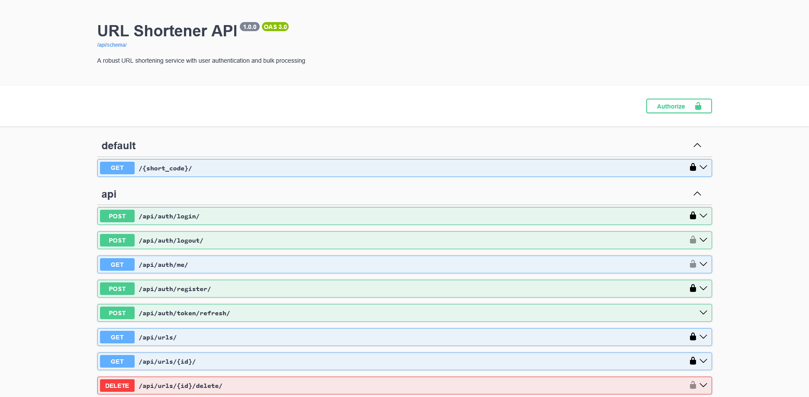
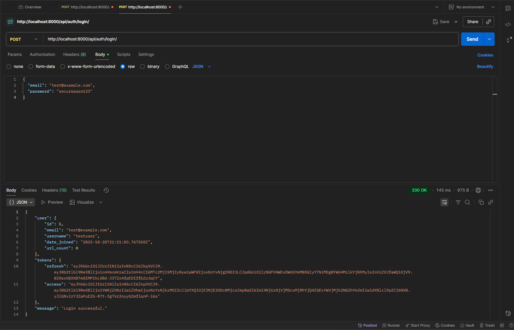
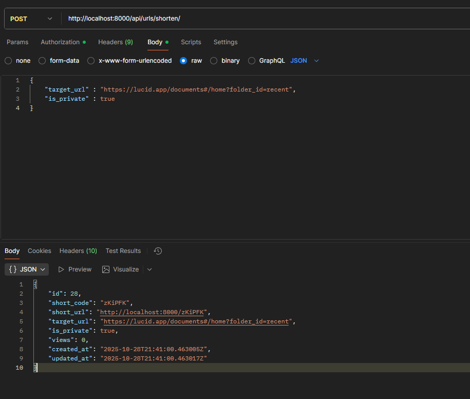

# URL Shortener Application

> **Note:** This README is also available in [Spanish (Español)](./README_ES.md)

A full-stack URL shortener application built with Django REST Framework and React + TypeScript. Create short, memorable URLs with analytics tracking, bulk upload support, and public/private URL options.


## Table of Contents

- [Features](#features)
- [Project Structure](#project-structure)
- [Prerequisites](#prerequisites)
- [Installation & Setup](#installation--setup)
  - [Option 1: Using Docker (Recommended)](#option-1-using-docker-recommended)
  - [Option 2: Manual Setup](#option-2-manual-setup)
- [Usage](#usage)
- [API Documentation](#api-documentation)
- [Testing](#testing)
- [Troubleshooting](#troubleshooting)
- [Exercise 1](#exercise-1)

## Features

- **URL Shortening**: Convert long URLs into short, memorable links
- **Public & Private URLs**: Control URL visibility with authentication
- **Analytics**: Track views and visitor information for each URL
- **Bulk Upload**: Upload multiple URLs at once via .txt files (up to 1000 URLs)
- **User Authentication**: JWT-based authentication with register/login
- **RESTful API**: Complete API with Swagger/OpenAPI documentation
- **Responsive UI**: Modern React interface with Material-UI components

## Project Structure

```
sunwise-url-web-app/
├── exercise1_python/           # Exercise 1: Python script (separate)
│   ├── src/
│   └── tests/
├── exercise2_service/          # Exercise 2: URL Shortener Service
│   ├── backend/                # Django REST Framework
│   │   ├── apps/
│   │   │   ├── accounts/      # User authentication
│   │   │   └── urlshortener/  # URL shortening logic
│   │   ├── project/           # Django settings
│   │   ├── Dockerfile
│   │   └── requirements.txt
│   ├── frontend/              # React + TypeScript
│   │   ├── src/
│   │   ├── Dockerfile
│   │   └── package.json
│   ├── docker-compose.yml     # Docker orchestration
│   └── README.md              # Detailed service documentation
├── test_urls.txt              # Sample URLs for bulk upload testing
└── README.md                  # This file
```

## Prerequisites

### For Docker Setup:
- Docker Desktop (version 20.10 or higher)
- Docker Compose (usually included with Docker Desktop)

### For Manual Setup:
- Python 3.11 or higher
- Node.js 18 or higher
- PostgreSQL 15 or higher
- Git

## Installation & Setup

### Option 1: Using Docker (Recommended)

Docker provides the easiest way to run the entire application stack.

1. **Clone the repository:**
   ```bash
   git clone https://github.com/pacheco20222/sunwise-url-web-app.git
   cd sunwise-url-web-app/exercise2_service
   ```

2. **Start all services:**
   ```bash
   docker-compose up --build
   ```

   This command will:
   - Build the backend and frontend Docker images
   - Start PostgreSQL database
   - Run database migrations automatically
   - Start the Django backend on port 8000
   - Start the React frontend on port 80

3. **Wait for services to be ready:**
   
   You should see these messages in the console:
   ```
   urlshortener_db       | database system is ready to accept connections
   urlshortener_backend  | Starting development server at http://0.0.0.0:8000/
   urlshortener_frontend | /docker-entrypoint.sh: Launching...
   ```

4. **Access the application:**
   - Frontend: http://localhost
   - Backend API: http://localhost:8000
   - API Documentation: http://localhost:8000/api/docs/

5. **Stop the application:**
   ```bash
   docker-compose down
   ```

   To remove all data (including database):
   ```bash
   docker-compose down -v
   ```

### Option 2: Manual Setup

If you prefer to run the application without Docker:

#### Backend Setup

1. **Navigate to backend directory:**
   ```bash
   cd exercise2_service/backend
   ```

2. **Create and activate virtual environment:**
   
   Windows:
   ```bash
   python -m venv venv
   .\venv\Scripts\activate
   ```
   
   Mac/Linux:
   ```bash
   python -m venv venv
   source venv/bin/activate
   ```

3. **Install dependencies:**
   ```bash
   pip install -r requirements.txt
   ```

4. **Set up PostgreSQL database:**
   
   Create a PostgreSQL database:
   ```sql
   CREATE DATABASE urlshortener;
   CREATE USER postgres WITH PASSWORD 'postgres123';
   GRANT ALL PRIVILEGES ON DATABASE urlshortener TO postgres;
   ```

5. **Configure environment variables:**
   
   Create a `.env` file in the `backend/` directory:
   ```env
   SECRET_KEY=django-insecure-dev-key-change-in-production
   DEBUG=True
   ALLOWED_HOSTS=localhost,127.0.0.1
   
   DB_NAME=urlshortener
   DB_USER=postgres
   DB_PASSWORD=postgres123
   DB_HOST=localhost
   DB_PORT=5432
   
   CORS_ALLOWED_ORIGINS=http://localhost:5173,http://127.0.0.1:5173
   
   SHORT_CODE_LENGTH=6
   BASE_URL=http://localhost:8000
   ```

6. **Run migrations:**
   ```bash
   python manage.py migrate
   ```

7. **Create superuser (optional):**
   ```bash
   python manage.py createsuperuser
   ```

8. **Start the backend server:**
   ```bash
   python manage.py runserver
   ```
   
   Backend will be available at http://localhost:8000

#### Frontend Setup

1. **Open a new terminal and navigate to frontend directory:**
   ```bash
   cd exercise2_service/frontend
   ```

2. **Install dependencies:**
   ```bash
   npm install
   ```

3. **Start the development server:**
   ```bash
   npm run dev
   ```
   
   Frontend will be available at http://localhost:5173

## Usage

### Creating Public URLs

1. Navigate to the home page (http://localhost or http://localhost:5173)
2. Enter a long URL in the input field
3. Click "Shorten URL"
4. Copy the generated short URL


### Creating Private URLs

1. Click "Login / Register for Private URLs" in the navigation bar
2. Create an account or log in
3. In your dashboard, toggle "Private URL" switch
4. Enter the URL and click "Shorten URL"


### Bulk Upload

1. Log in to your account
2. Navigate to "Bulk Upload" from the navigation menu
3. Upload a `.txt` file with one URL per line
4. View the results showing successful and failed URLs


**Test File:** Use the included `test_urls.txt` file in the project root for testing bulk uploads.

### Viewing Analytics

The dashboard displays analytics for each shortened URL:
- Number of views
- Creation date
- Public/Private status
- Owner information


## API Documentation

### Interactive API Documentation

Access the interactive Swagger UI documentation at:
- http://localhost:8000/api/docs/



### Postman Collection

API endpoints can be tested using Postman. Here are the key endpoints:

#### Authentication Endpoints

**Register User:**
```http
POST /api/auth/register/
Content-Type: application/json

{
  "email": "user@example.com",
  "username": "testuser",
  "password": "securepass123",
  "password2": "securepass123"
}
```


**Login:**
```http
POST /api/auth/login/
Content-Type: application/json

{
  "email": "user@example.com",
  "password": "securepass123"
}
```



#### URL Shortening Endpoints

**Create Short URL:**
```http
POST /api/urls/shorten/
Authorization: Bearer <access_token>
Content-Type: application/json

{
  "target_url": "https://example.com/very/long/url",
  "is_private": false
}
```



**List URLs:**
```http
GET /api/urls/
Authorization: Bearer <access_token>
```


**Bulk Upload:**

To test bulk upload functionality, navigate to the Bulk Upload page in the application (see main app screenshot above). Click the "Bulk Upload" button in the navigation menu and upload a `.txt` file with one URL per line. The application will process the file and display successful and failed URLs.

**Redirect (Access Short URL):**
```http
GET /{short_code}
```

For detailed API documentation, see the [Backend README](./exercise2_service/backend/README.md).

## Testing

### Backend Tests

Run Django tests:
```bash
cd exercise2_service/backend
python manage.py test
```

### Frontend Tests

Run React component tests:
```bash
cd exercise2_service/frontend
npm test
```

### Manual Testing

Use the provided `test_urls.txt` file for bulk upload testing. The file contains 10 sample URLs.

## Troubleshooting

### Port Already in Use

If you encounter port conflicts:

**Docker Setup:**
- Port 80 (Frontend): Modify `docker-compose.yml` ports section to use a different port:
  ```yaml
  frontend:
    ports:
      - "3000:80"  # Use port 3000 instead
  ```
- Port 8000 (Backend): Change to `"8001:8000"` in docker-compose.yml
- Port 5432 (PostgreSQL): Change to `"5433:5432"` in docker-compose.yml

**Manual Setup:**
- Frontend: Vite will automatically use the next available port (5174, 5175, etc.)
- Backend: Run on a different port:
  ```bash
  python manage.py runserver 8001
  ```
- PostgreSQL: Configure a different port in your `.env` file

### Database Connection Issues

**Docker:**
- Ensure Docker is running
- Check database health: `docker-compose ps`
- View logs: `docker-compose logs db`

**Manual Setup:**
- Verify PostgreSQL is running
- Check credentials in `.env` file
- Test connection: `psql -U postgres -d urlshortener`

### Frontend Not Loading

- Clear browser cache
- Check console for errors (F12)
- Verify backend is running and accessible
- Check CORS settings in backend `.env` file

### Docker Build Fails

- Ensure Docker has enough resources (Settings > Resources)
- Clear Docker cache: `docker-compose build --no-cache`
- Remove old containers: `docker-compose down -v`

## Exercise 1

Exercise 1 is a separate Python script located in the `exercise1_python/` directory. It can be run independently:

```bash
cd exercise1_python
python src/main.py
```

For more details, see the README in the `exercise1_python/` directory.

## License

This project is licensed under the MIT License - see the LICENSE file for details.

## Author

Created for Sunwise Technical Interview

GitHub: [pacheco20222](https://github.com/pacheco20222)
