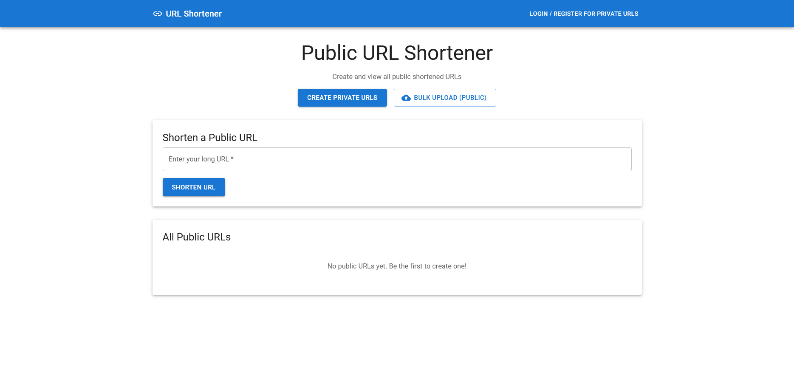
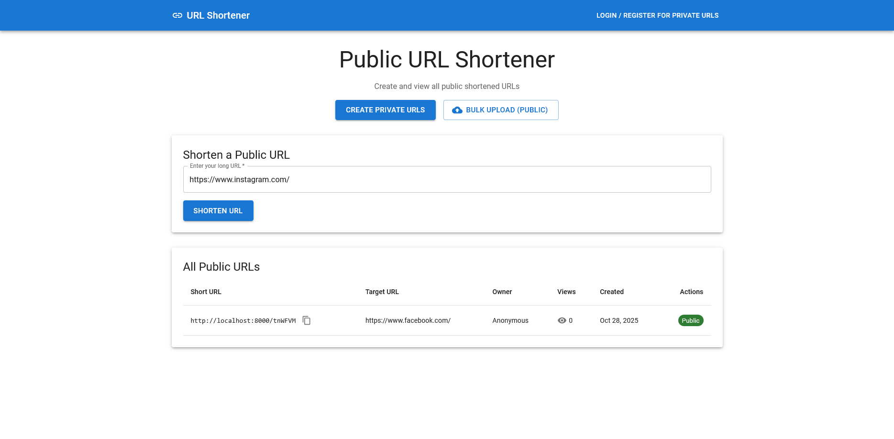
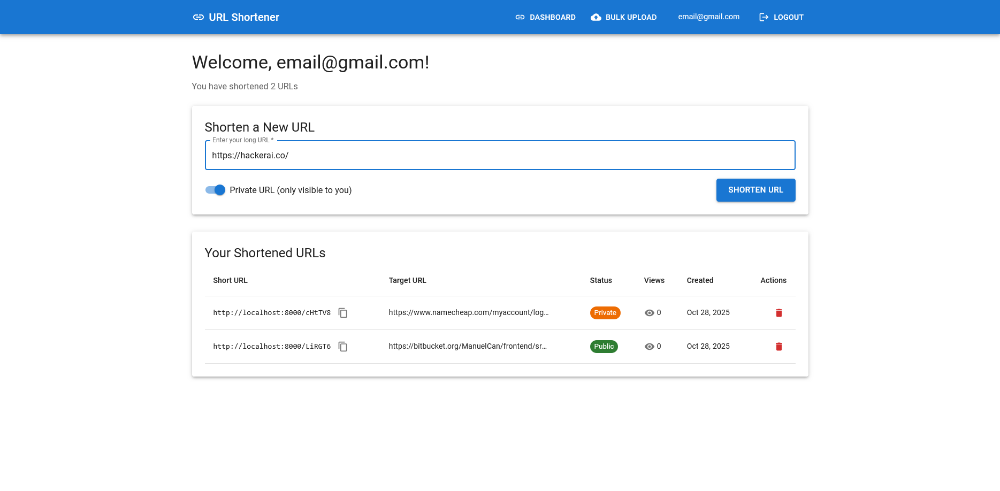
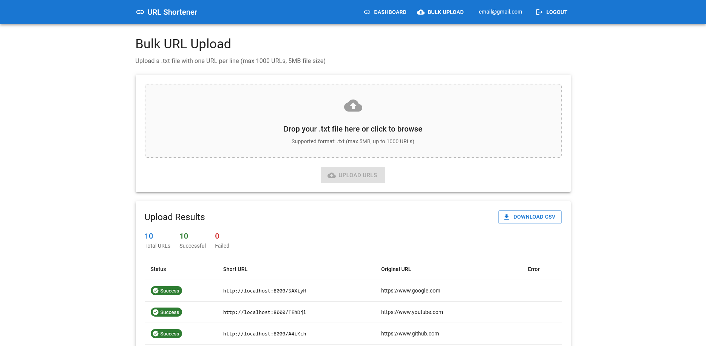

# Aplicación Acortador de URLs

> **Nota:** Este README también está disponible en [Inglés (English)](./README.md)

Una aplicación completa de acortamiento de URLs construida con Django REST Framework y React + TypeScript. Crea URLs cortas y memorables con seguimiento de analíticas, soporte para carga masiva y opciones de URLs públicas/privadas.



## Tabla de Contenidos

- [Ejercicio 1: Dirección del Espiral en Cuadrícula](#ejercicio-1-dirección-del-espiral-en-cuadrícula)
- [Ejercicio 2: Servicio Acortador de URLs](#ejercicio-2-servicio-acortador-de-urls)
  - [Características](#características)
  - [Estructura del Proyecto](#estructura-del-proyecto)
  - [Requisitos Previos](#requisitos-previos)
  - [Instalación y Configuración](#instalación-y-configuración)
  - [Uso](#uso)
  - [Documentación de la API](#documentación-de-la-api)
  - [Pruebas](#pruebas)
  - [Solución de Problemas](#solución-de-problemas)

---

## Ejercicio 1: Dirección del Espiral en Cuadrícula

Una solución en Python para el problema de caminar en espiral sobre una cuadrícula.

### Descripción del Problema

Comenzando en la esquina superior izquierda de una cuadrícula N x M y mirando hacia la derecha, caminas una casilla a la vez en la dirección que estás mirando. Si alcanzas el límite de la cuadrícula o si la siguiente casilla que estás por visitar ya ha sido visitada, giras a la derecha. Te detienes cuando todas las casillas han sido visitadas.

**Pregunta:** ¿En qué dirección estarás mirando cuando te detengas?

**Ejemplo:** Para una cuadrícula 3x3, el camino es: (0,0) → (0,1) → (0,2) → (1,2) → (2,2) → (2,1) → (2,0) → (1,0) → (1,1). Dirección final: **Derecha (R)**

### Especificación de Entrada

- Primera línea: T (número de casos de prueba)
- Siguientes T líneas: Dos enteros N y M (filas y columnas)
- Restricciones: 1 ≤ T ≤ 5000, 1 ≤ N, M ≤ 10^9

### Especificación de Salida

T líneas con la dirección final: **L** (izquierda), **R** (derecha), **U** (arriba), o **D** (abajo)

### Ejemplo

**Entrada:**
```
4
1 1
2 2
3 1
3 3
```

**Salida:**
```
R
L
D
R
```

### Ejecutar Ejercicio 1

1. **Navegar al directorio exercise1:**
   ```bash
   cd exercise1_python
   ```

2. **Instalar dependencias (opcional, solo para pruebas):**
   ```bash
   pip install -r requirements.txt
   ```

3. **Ejecutar con el archivo de entrada proporcionado:**
   ```bash
   python src/main.py < input.txt
   ```

4. **O ejecutar con entrada personalizada:**
   ```bash
   echo "4
   1 1
   2 2
   3 1
   3 3" | python src/main.py
   ```

5. **Ejecutar pruebas:**
   ```bash
   pytest tests/
   ```

### Algoritmo de la Solución

La solución usa un patrón matemático en lugar de simular todo el espiral:
- Si N ≤ M: Dirección final es **R** (N impar) o **L** (N par)
- Si N > M: Dirección final es **D** (M impar) o **U** (M par)

Complejidad temporal: O(1) por caso de prueba

---

## Ejercicio 2: Servicio Acortador de URLs

## Características

- **Acortamiento de URLs**: Convierte URLs largas en enlaces cortos y memorables
- **URLs Públicas y Privadas**: Control de visibilidad de URLs con autenticación
- **Analíticas**: Seguimiento de vistas e información de visitantes para cada URL
- **Carga Masiva**: Sube múltiples URLs a la vez mediante archivos .txt (hasta 1000 URLs)
- **Autenticación de Usuario**: Autenticación basada en JWT con registro/inicio de sesión
- **API RESTful**: API completa con documentación Swagger/OpenAPI
- **Interfaz Responsiva**: Interfaz moderna de React con componentes Material-UI

## Estructura del Proyecto

```
sunwise-url-web-app/
├── exercise1_python/           # Ejercicio 1: Script Python (separado)
│   ├── src/
│   └── tests/
├── exercise2_service/          # Ejercicio 2: Servicio Acortador de URLs
│   ├── backend/                # Django REST Framework
│   │   ├── apps/
│   │   │   ├── accounts/      # Autenticación de usuarios
│   │   │   └── urlshortener/  # Lógica de acortamiento
│   │   ├── project/           # Configuración Django
│   │   ├── Dockerfile
│   │   └── requirements.txt
│   ├── frontend/              # React + TypeScript
│   │   ├── src/
│   │   ├── Dockerfile
│   │   └── package.json
│   ├── docker-compose.yml     # Orquestación Docker
│   └── README.md              # Documentación detallada
├── test_urls.txt              # URLs de ejemplo para pruebas
└── README.md                  # Este archivo
```

## Requisitos Previos

### Para Configuración con Docker

- Docker Desktop (versión 20.10 o superior)
- Docker Compose (generalmente incluido con Docker Desktop)

### Para Configuración Manual

- Python 3.11 o superior
- Node.js 18 o superior
- PostgreSQL 15 o superior
- Git

## Instalación y Configuración

### Opción 1: Usando Docker (Recomendado)

Docker proporciona la forma más fácil de ejecutar toda la aplicación.

1. **Clonar el repositorio:**
   ```bash
   git clone https://github.com/pacheco20222/sunwise-url-web-app.git
   cd sunwise-url-web-app/exercise2_service
   ```

2. **Iniciar todos los servicios:**
   ```bash
   docker-compose up --build
   ```

   Este comando:
   - Construye las imágenes Docker del backend y frontend
   - Inicia la base de datos PostgreSQL
   - Ejecuta las migraciones de base de datos automáticamente
   - Inicia el backend Django en el puerto 8000
   - Inicia el frontend React en el puerto 80

3. **Esperar a que los servicios estén listos:**
   
   Deberías ver estos mensajes en la consola:
   ```
   urlshortener_db       | database system is ready to accept connections
   urlshortener_backend  | Starting development server at http://0.0.0.0:8000/
   urlshortener_frontend | /docker-entrypoint.sh: Launching...
   ```

4. **Acceder a la aplicación:**
   
   **Con Docker:**
   - Frontend: http://localhost (nginx sirve en el puerto 80)
   - API Backend: http://localhost:8000
   - Documentación API: http://localhost:8000/api/docs/
   
   > **Nota:** Docker usa nginx como proxy inverso para servir el frontend en el puerto 80, por eso accedes en `http://localhost` sin especificar puerto.

5. **Detener la aplicación:**
   ```bash
   docker-compose down
   ```

   Para eliminar todos los datos (incluida la base de datos):
   ```bash
   docker-compose down -v
   ```

### Opción 2: Configuración Manual

Si prefieres ejecutar la aplicación sin Docker:

#### Configuración del Backend

1. **Navegar al directorio backend:**
   ```bash
   cd exercise2_service/backend
   ```

2. **Crear y activar entorno virtual:**
   
   Windows:
   ```bash
   python -m venv venv
   .\venv\Scripts\activate
   ```
   
   Mac/Linux:
   ```bash
   python -m venv venv
   source venv/bin/activate
   ```

3. **Instalar dependencias:**
   ```bash
   pip install -r requirements.txt
   ```

4. **Configurar base de datos PostgreSQL:**
   
   Crear una base de datos PostgreSQL:
   ```sql
   CREATE DATABASE urlshortener;
   CREATE USER postgres WITH PASSWORD 'postgres123';
   GRANT ALL PRIVILEGES ON DATABASE urlshortener TO postgres;
   ```

5. **Configurar variables de entorno:**
   
   Crear un archivo `.env` en el directorio `backend/`:
   ```env
   SECRET_KEY=django-insecure-dev-key-change-in-production
   DEBUG=True
   ALLOWED_HOSTS=localhost,127.0.0.1
   
   DB_NAME=urlshortener
   DB_USER=postgres
   DB_PASSWORD=postgres123
   DB_HOST=localhost
   DB_PORT=5432
   
   CORS_ALLOWED_ORIGINS=http://localhost:5173,http://127.0.0.1:5173
   
   SHORT_CODE_LENGTH=6
   BASE_URL=http://localhost:8000
   ```

   > **Importante:** Si Vite asigna un puerto diferente (ej. 5174, 5175), actualiza `CORS_ALLOWED_ORIGINS` para coincidir:
   > ```env
   > CORS_ALLOWED_ORIGINS=http://localhost:5174,http://127.0.0.1:5174
   > ```

6. **Ejecutar migraciones:**
   ```bash
   python manage.py migrate
   ```

7. **Crear superusuario (opcional):**
   ```bash
   python manage.py createsuperuser
   ```

8. **Iniciar el servidor backend:**
   ```bash
   python manage.py runserver
   ```
   
   El backend estará disponible en http://localhost:8000

#### Configuración del Frontend

1. **Abrir una nueva terminal y navegar al directorio frontend:**
   ```bash
   cd exercise2_service/frontend
   ```

2. **Instalar dependencias:**
   ```bash
   npm install
   ```

3. **Iniciar el servidor de desarrollo:**
   ```bash
   npm run dev
   ```
   
   El frontend estará disponible en http://localhost:5173 (o el siguiente puerto disponible si 5173 está en uso)
   
   > **Nota:** Vite usará automáticamente el siguiente puerto disponible (5174, 5175, etc.) si 5173 está ocupado. Verifica la salida en la terminal para la URL real y actualiza la variable `CORS_ALLOWED_ORIGINS` en el archivo `.env` del backend en consecuencia.

## Uso

### Crear URLs Públicas

**Con Docker:** Navega a http://localhost (nginx en puerto 80)

**Sin Docker:** Navega a http://localhost:5173 (o el puerto de tu servidor de desarrollo Vite)
2. Ingresar una URL larga en el campo de entrada
3. Hacer clic en "Shorten URL"
4. Copiar la URL corta generada



### Crear URLs Privadas

1. Hacer clic en "Login / Register for Private URLs" en la barra de navegación
2. Crear una cuenta o iniciar sesión
3. En tu panel, activar el interruptor "Private URL"
4. Ingresar la URL y hacer clic en "Shorten URL"



### Carga Masiva

1. Iniciar sesión en tu cuenta
2. Navegar a "Bulk Upload" desde el menú de navegación
3. Subir un archivo `.txt` con una URL por línea
4. Ver los resultados mostrando URLs exitosas y fallidas



**Archivo de Prueba:** Usa el archivo `test_urls.txt` incluido en la raíz del proyecto para probar cargas masivas.

### Ver Analíticas

El panel muestra analíticas para cada URL acortada:
- Número de vistas
- Fecha de creación
- Estado Público/Privado
- Información del propietario


## Documentación de la API

### Documentación Interactiva

Accede a la documentación interactiva Swagger UI en:
- http://localhost:8000/api/docs/


### Colección Postman

Los endpoints de la API se pueden probar usando Postman. Aquí están los endpoints principales:

Para documentación detallada de la API, consulta el [README del Backend](./exercise2_service/backend/README.md).

## Pruebas

### Pruebas del Backend

Ejecutar pruebas de Django:
```bash
cd exercise2_service/backend
python manage.py test
```

### Pruebas del Frontend

Ejecutar pruebas de componentes React:
```bash
cd exercise2_service/frontend
npm test
```

### Pruebas Manuales

Usa el archivo `test_urls.txt` proporcionado para pruebas de carga masiva. El archivo contiene 10 URLs de ejemplo.

## Solución de Problemas

Consulta la [versión en inglés del README](./README.md#troubleshooting) para información detallada sobre solución de problemas.

## Licencia

Este proyecto está licenciado bajo la Licencia MIT - ver el archivo LICENSE para detalles.

## Autor

Creado para Entrevista Técnica Sunwise

GitHub: [pacheco20222](https://github.com/pacheco20222)
