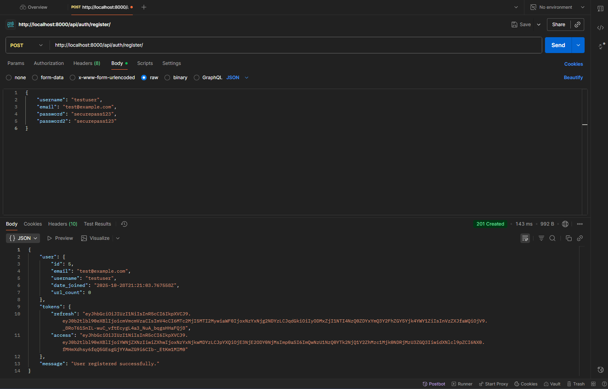
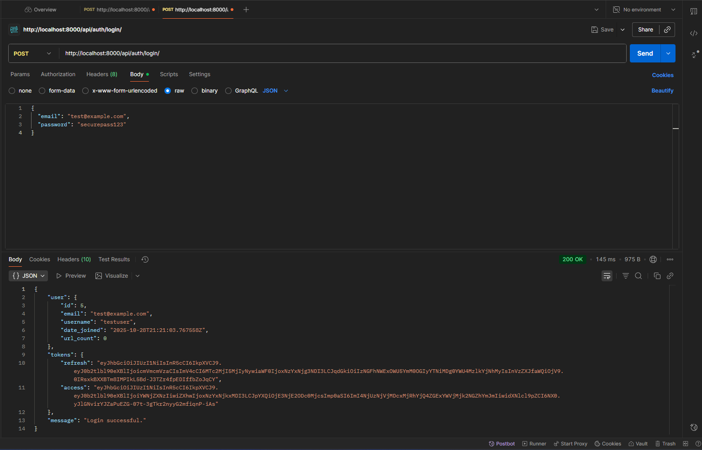
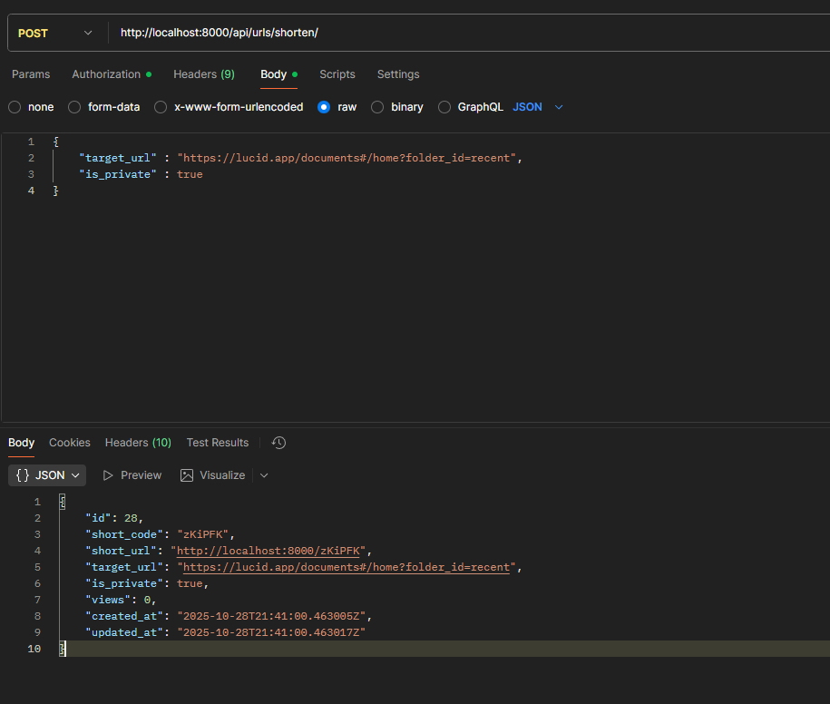
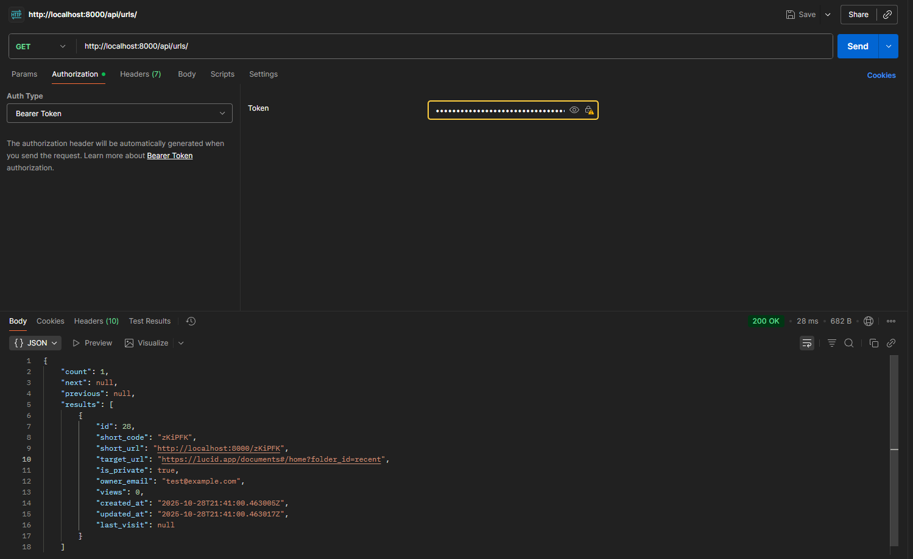

# Backend - Django REST Framework URL Shortener# URL Shortener API - Backend


This is the backend API for the URL Shortener application, built with Django 4.2.7 and Django REST Framework.Django REST Framework backend for URL shortening service with user authentication and analytics.


## Table of Contents## Features


- [Technology Stack](#technology-stack)- 🔗 URL shortening with custom codes

- [Project Structure](#project-structure)- 🔐 User authentication (JWT)

- [API Endpoints](#api-endpoints)- 🔒 Public and private URLs

- [Authentication](#authentication)- 📊 Visit analytics tracking

- [Database Schema](#database-schema)- 📤 Bulk URL upload (.txt files)

- [Configuration](#configuration)- 👑 Django admin panel

- [Running Locally](#running-locally)- 📖 Swagger API documentation

- [Testing](#testing)

## Tech Stack

## Technology Stack

- Python 3.12+

- **Django 4.2.7**: Web framework- Django 4.2

- **Django REST Framework 3.14.0**: REST API toolkit- Django REST Framework

- **djangorestframework-simplejwt 5.3.0**: JWT authentication- PostgreSQL

- **PostgreSQL 15**: Primary database- JWT Authentication

- **psycopg2-binary 2.9.10**: PostgreSQL adapter- Docker (PostgreSQL)

- **django-environ 0.11.2**: Environment variable management

- **drf-spectacular 0.27.0**: OpenAPI schema generation## Quick Start


## Project Structure### 1. Setup Environment


``````bash

backend/cd exercise2_service/backend

├── apps/python -m venv venv

│   ├── accounts/              # User authentication appvenv\Scripts\activate  # Windows

│   │   ├── models.py         # Custom User modelpip install -r requirements/dev.txt

│   │   ├── serializers.py    # User serializers```

│   │   └── views.py          # Register/login views

│   │### 2. Configure Environment Variables

│   └── urlshortener/         # URL shortening app

│       ├── models.py         # URL and Analytics modelsCreate `.env` file:

│       ├── serializers.py    # URL serializers

│       ├── views.py          # URL CRUD and redirect views```env

│       └── utils.py          # Short code generationDEBUG=True

│SECRET_KEY=your-secret-key-here

├── project/ALLOWED_HOSTS=localhost,127.0.0.1

│   ├── settings.py           # Django settings

│   ├── urls.py              # URL routingDB_NAME=urlshortener

│   └── wsgi.py              # WSGI applicationDB_USER=postgres

│DB_PASSWORD=postgres123

├── manage.py                # Django management scriptDB_HOST=localhost

├── requirements.txt         # Python dependenciesDB_PORT=5432

└── Dockerfile              # Docker configuration

```CORS_ALLOWED_ORIGINS=http://localhost:5173,http://127.0.0.1:5173


## API EndpointsSHORT_CODE_LENGTH=6

BASE_URL=http://localhost:8000

### Authentication Endpoints```


#### Register User### 3. Start PostgreSQL (Docker)

```http

POST /api/accounts/register/```bash

Content-Type: application/jsoncd ..

docker-compose up -d

{```

  "username": "testuser",

  "email": "test@example.com",### 4. Run Migrations

  "password": "securepassword123",

  "password2": "securepassword123"```bash

}cd backend

```python manage.py migrate

```

**Response (201 Created):**

```json### 5. Create Superuser

{

  "id": 1,```bash

  "username": "testuser",python create_superuser.py

  "email": "test@example.com",# Or manually: python manage.py createsuperuser

  "message": "User created successfully"```

}

```### 6. Start Server


```bash

python manage.py runserver

#### Login```

```http

POST /api/accounts/login/Server runs at: http://localhost:8000

Content-Type: application/json

## API Endpoints

{

  "username": "testuser",### Authentication

  "password": "securepassword123"

}| Method | Endpoint | Description |

```|--------|----------|-------------|

| POST | `/api/auth/register/` | Register new user |

**Response (200 OK):**| POST | `/api/auth/login/` | Login and get tokens |

```json| POST | `/api/auth/logout/` | Logout (blacklist token) |

{| GET | `/api/auth/me/` | Get current user |

  "access": "eyJ0eXAiOiJKV1QiLCJhbGc...",| POST | `/api/auth/token/refresh/` | Refresh access token |

  "refresh": "eyJ0eXAiOiJKV1QiLCJhbGc...",

  "user": {### URL Shortening

    "id": 1,

    "username": "testuser",| Method | Endpoint | Description |

    "email": "test@example.com"|--------|----------|-------------|

  }| POST | `/api/urls/shorten/` | Shorten single URL |

}| POST | `/api/urls/bulk/` | Bulk upload (.txt file) |

```| GET | `/api/urls/` | List user's URLs |

| GET | `/api/urls/{id}/` | Get URL details |

| PATCH | `/api/urls/{id}/update/` | Update URL |

| DELETE | `/api/urls/{id}/delete/` | Delete URL |

#### Refresh Token| GET | `/{short_code}/` | Redirect to target URL |

```http

POST /api/accounts/token/refresh/### Documentation

Content-Type: application/json

| Endpoint | Description |

{|----------|-------------|

  "refresh": "eyJ0eXAiOiJKV1QiLCJhbGc..."| `/api/docs/` | Swagger UI |

}| `/api/redoc/` | ReDoc UI |

```| `/api/schema/` | OpenAPI schema (JSON) |


**Response (200 OK):**### Admin Panel

```json

{Access at: http://localhost:8000/admin/

  "access": "eyJ0eXAiOiJKV1QiLCJhbGc..."- Default credentials: `admin@urlshortener.com` / `admin123`

}

```## API Examples


#### Logout### Register User

```http

POST /api/accounts/logout/```bash

Authorization: Bearer <access_token>POST /api/auth/register/

Content-Type: application/json{

  "email": "user@example.com",

{  "username": "johndoe",

  "refresh": "eyJ0eXAiOiJKV1QiLCJhbGc..."  "password": "SecurePass123!",

}  "password2": "SecurePass123!"

```}

```

**Response (205 Reset Content):**

```json### Shorten URL

{

  "message": "Logout successful"```bash

}POST /api/urls/shorten/

```Authorization: Bearer <access_token>

{

### URL Shortening Endpoints  "target_url": "https://www.google.com",

  "is_private": false

#### Shorten URL}

```http```

POST /api/urlshortener/shorten/

Authorization: Bearer <access_token>  # Optional for public URLs### Bulk Upload

Content-Type: application/json

```bash

{POST /api/urls/bulk/

  "original_url": "https://www.example.com/very/long/url/path",Authorization: Bearer <access_token>

  "is_private": false,  # Optional, defaults to falseContent-Type: multipart/form-data

  "custom_short_code": "mycode"  # Optional

}file: urls.txt

``````


**Response (201 Created):**## Project Structure

```json

{```

  "id": 1,backend/

  "short_code": "abc123",├── apps/

  "short_url": "http://localhost:8000/abc123",│   ├── accounts/          # User authentication

  "original_url": "https://www.example.com/very/long/url/path",│   │   ├── models.py

  "is_private": false,│   │   ├── serializers.py

  "created_at": "2025-01-15T10:30:00Z",│   │   ├── views.py

  "owner": {│   │   └── urls.py

    "id": 1,│   └── urlshortener/      # URL shortening

    "username": "testuser"│       ├── models.py

  },│       ├── serializers.py

  "analytics": {│       ├── views.py

    "total_views": 0│       └── urls.py

  }├── project/

}│   ├── settings.py

```│   └── urls.py

├── requirements/

│   ├── base.txt

│   ├── dev.txt

#### List URLs│   └── prod.txt

```http└── manage.py

GET /api/urlshortener/urls/```

Authorization: Bearer <access_token>  # Optional

```## Security Features


**Behavior:**- JWT token authentication

- **Without authentication**: Returns all public URLs- Token blacklisting on logout

- **With authentication**: Returns user's own URLs (public and private)- Password validation

- CORS configuration

**Response (200 OK):**- Rate limiting (throttling)

```json- Owner-only URL editing

{- Private URL access control

  "count": 2,

  "next": null,## Testing

  "previous": null,

  "results": [```bash

    {# Run all tests

      "id": 1,pytest

      "short_code": "abc123",

      "short_url": "http://localhost:8000/abc123",# Run with coverage

      "original_url": "https://www.example.com",pytest --cov=apps

      "is_private": false,

      "created_at": "2025-01-15T10:30:00Z",# Run specific tests

      "owner": {pytest apps/accounts/tests.py

        "id": 1,```

        "username": "testuser"

      },## Development

      "analytics": {

        "total_views": 5```bash

      }# Create migrations

    },python manage.py makemigrations

    {

      "id": 2,# Apply migrations

      "short_code": "xyz789",python manage.py migrate

      "short_url": "http://localhost:8000/xyz789",

      "original_url": "https://www.anothersite.com",# Create superuser

      "is_private": true,python manage.py createsuperuser

      "created_at": "2025-01-15T11:00:00Z",

      "owner": {# Run development server

        "id": 1,python manage.py runserver

        "username": "testuser"

      },# Django shell

      "analytics": {python manage.py shell

        "total_views": 2```

      }

    }## Environment Variables

  ]

}| Variable | Description | Default |

```|----------|-------------|---------|

| `DEBUG` | Debug mode | `True` |

| `SECRET_KEY` | Django secret key | - |

| `DB_NAME` | Database name | `urlshortener` |

#### Get URL Details| `DB_USER` | Database user | `postgres` |

```http| `DB_PASSWORD` | Database password | - |

GET /api/urlshortener/urls/{id}/| `DB_HOST` | Database host | `localhost` |

Authorization: Bearer <access_token>  # Required for private URLs| `DB_PORT` | Database port | `5432` |

```| `SHORT_CODE_LENGTH` | Short code length | `6` |

| `BASE_URL` | Base URL for short links | `http://localhost:8000` |

**Response (200 OK):** Same structure as single URL object above| `MAX_FILE_SIZE` | Max upload size (bytes) | `5242880` (5MB) |

| `MAX_URLS_PER_UPLOAD` | Max URLs per bulk upload | `1000` |

#### Update URL

```http## License

PUT /api/urlshortener/urls/{id}/

Authorization: Bearer <access_token>MIT

Content-Type: application/json

{
  "original_url": "https://www.updated-url.com",
  "is_private": true
}
```

**Response (200 OK):** Updated URL object

#### Delete URL
```http
DELETE /api/urlshortener/urls/{id}/
Authorization: Bearer <access_token>
```

**Response (204 No Content)**

#### Bulk Upload
```http
POST /api/urlshortener/bulk-upload/
Authorization: Bearer <access_token>
Content-Type: multipart/form-data

file: [.txt file with one URL per line]
is_private: false  # Optional
```

**Response (201 Created):**
```json
{
  "message": "Processed 10 URLs",
  "successful": [
    {
      "original_url": "https://www.google.com",
      "short_code": "abc123",
      "short_url": "http://localhost:8000/abc123"
    },
    {
      "original_url": "https://www.github.com",
      "short_code": "def456",
      "short_url": "http://localhost:8000/def456"
    }
  ],
  "failed": [
    {
      "url": "not-a-valid-url",
      "error": "Invalid URL format"
    }
  ],
  "stats": {
    "total": 10,
    "successful_count": 8,
    "failed_count": 2
  }
}
```

**Requirements:**
- File must be .txt format
- Maximum 1000 URLs per upload
- One URL per line
- Empty lines and whitespace are ignored

**Note:** For testing bulk upload functionality, you can use the application's web interface (Bulk Upload page) where you can upload a `.txt` file and see the results visually.

### Redirect Endpoint

#### Redirect to Original URL
```http
GET /{short_code}
Authorization: Bearer <access_token>  # Required for private URLs
```

**Behavior:**
- **Public URLs**: Redirects without authentication
- **Private URLs**: Requires valid JWT token, returns 401 if not authenticated
- Records analytics (view count, user agent, IP address, referrer)

**Response:** HTTP 302 redirect to original URL

**Error Response (404 Not Found):**
```json
{
  "error": "URL not found"
}
```

**Error Response (401 Unauthorized):**
```json
{
  "error": "Authentication required for private URLs"
}
```

## Authentication

The API uses JWT (JSON Web Token) authentication via `djangorestframework-simplejwt`.

### Token Lifecycle

1. **Login**: Receive `access` and `refresh` tokens
2. **Access Token**: Valid for 60 minutes, used for authenticated requests
3. **Refresh Token**: Valid for 24 hours, used to get new access tokens
4. **Logout**: Blacklists the refresh token

### Using Tokens

Include the access token in the `Authorization` header:

```
Authorization: Bearer <access_token>
```

### Token Refresh Strategy

When an access token expires (401 response), use the refresh token to get a new one:

```http
POST /api/accounts/token/refresh/
Content-Type: application/json

{
  "refresh": "<refresh_token>"
}
```

## Database Schema

### User Model
Located in `apps/accounts/models.py`

```python
class User(AbstractUser):
    email = models.EmailField(unique=True)
    created_at = models.DateTimeField(auto_now_add=True)
    updated_at = models.DateTimeField(auto_now=True)
```

**Fields:**
- `id`: Primary key (auto)
- `username`: Unique username
- `email`: Unique email address
- `password`: Hashed password
- `created_at`: Account creation timestamp
- `updated_at`: Last update timestamp

### URL Model
Located in `apps/urlshortener/models.py`

```python
class URL(models.Model):
    owner = models.ForeignKey(User, on_delete=models.CASCADE, null=True, blank=True)
    original_url = models.URLField(max_length=2048)
    short_code = models.CharField(max_length=10, unique=True)
    is_private = models.BooleanField(default=False)
    created_at = models.DateTimeField(auto_now_add=True)
    updated_at = models.DateTimeField(auto_now=True)
```

**Fields:**
- `id`: Primary key (auto)
- `owner`: Foreign key to User (nullable for public URLs)
- `original_url`: The original long URL (max 2048 chars)
- `short_code`: Unique short identifier (6 chars default)
- `is_private`: Boolean flag for private URLs
- `created_at`: URL creation timestamp
- `updated_at`: Last update timestamp

**Methods:**
- `get_absolute_url()`: Returns the full short URL

### Analytics Model
Located in `apps/urlshortener/models.py`

```python
class Analytics(models.Model):
    url = models.ForeignKey(URL, on_delete=models.CASCADE, related_name='views')
    user_agent = models.CharField(max_length=255, blank=True)
    ip_address = models.GenericIPAddressField()
    referrer = models.URLField(max_length=2048, blank=True)
    timestamp = models.DateTimeField(auto_now_add=True)
```

**Fields:**
- `id`: Primary key (auto)
- `url`: Foreign key to URL
- `user_agent`: Browser/client information
- `ip_address`: Visitor's IP address
- `referrer`: Source URL (if available)
- `timestamp`: View timestamp

## Configuration

### Environment Variables

Create a `.env` file in the backend directory:

```env
# Django Settings
SECRET_KEY=your-secret-key-here
DEBUG=True
ALLOWED_HOSTS=localhost,127.0.0.1

# Database Settings
DB_NAME=urlshortener
DB_USER=postgres
DB_PASSWORD=your-db-password
DB_HOST=localhost
DB_PORT=5432

# CORS Settings
CORS_ALLOWED_ORIGINS=http://localhost:5173,http://localhost:3000

# URL Shortener Settings
SHORT_CODE_LENGTH=6
BASE_URL=http://localhost:8000
```

> **Important:** The `CORS_ALLOWED_ORIGINS` setting must match your frontend URL. If Vite assigns a different port (e.g., 5174, 5175), update this value accordingly:
> ```env
> CORS_ALLOWED_ORIGINS=http://localhost:5174,http://127.0.0.1:5174
> ```
> This is necessary to allow the frontend to make requests to the backend API.

### Settings Modules

The `project/settings.py` file uses `django-environ` to load environment variables:

```python
import environ

env = environ.Env()
environ.Env.read_env()

SECRET_KEY = env('SECRET_KEY')
DEBUG = env.bool('DEBUG', default=False)
```

### Database Configuration

PostgreSQL is configured in `settings.py`:

```python
DATABASES = {
    'default': {
        'ENGINE': 'django.db.backends.postgresql',
        'NAME': env('DB_NAME'),
        'USER': env('DB_USER'),
        'PASSWORD': env('DB_PASSWORD'),
        'HOST': env('DB_HOST'),
        'PORT': env('DB_PORT'),
    }
}
```

### CORS Configuration

Configured to allow frontend requests:

```python
CORS_ALLOWED_ORIGINS = env.list('CORS_ALLOWED_ORIGINS')
CORS_ALLOW_CREDENTIALS = True
```

## Running Locally

### Prerequisites

- Python 3.11+
- PostgreSQL 15+
- pip and virtualenv

### Setup Steps

1. **Create virtual environment:**
   ```bash
   python -m venv venv
   source venv/bin/activate  # On Windows: .\venv\Scripts\activate
   ```

2. **Install dependencies:**
   ```bash
   pip install -r requirements.txt
   ```

3. **Configure environment:**
   - Copy `.env.example` to `.env` (if provided)
   - Or create `.env` with settings from the Configuration section

4. **Run migrations:**
   ```bash
   python manage.py migrate
   ```

5. **Create superuser (optional):**
   ```bash
   python manage.py createsuperuser
   ```

6. **Start development server:**
   ```bash
   python manage.py runserver
   ```

The API will be available at `http://localhost:8000`

### Admin Panel

Access the Django admin panel at `http://localhost:8000/admin/` to manage:
- Users
- URLs
- Analytics

## Testing

### Run All Tests

```bash
python manage.py test
```

### Run Specific App Tests

```bash
python manage.py test apps.accounts
python manage.py test apps.urlshortener
```

### Run with Coverage

```bash
pip install coverage
coverage run --source='.' manage.py test
coverage report
```

### Test Structure

Tests are located in each app's `tests/` directory:

```
apps/
├── accounts/
│   └── tests/
│       ├── test_models.py
│       ├── test_views.py
│       └── test_serializers.py
│
└── urlshortener/
    └── tests/
        ├── test_models.py
        ├── test_views.py
        ├── test_serializers.py
        └── test_utils.py
```

### Example Test

```python
from django.test import TestCase
from apps.accounts.models import User

class UserModelTest(TestCase):
    def test_user_creation(self):
        user = User.objects.create_user(
            username='testuser',
            email='test@example.com',
            password='testpass123'
        )
        self.assertEqual(user.username, 'testuser')
        self.assertTrue(user.check_password('testpass123'))
```

## API Documentation

### Interactive Documentation

The API provides interactive documentation using drf-spectacular:

- **Swagger UI**: http://localhost:8000/api/docs/
- **ReDoc**: http://localhost:8000/api/redoc/
- **OpenAPI Schema**: http://localhost:8000/api/schema/

### Postman Collection

You can import the API endpoints into Postman:

1. Open Postman
2. Import > Link
3. Enter: `http://localhost:8000/api/schema/`
4. Select OpenAPI 3.0 format

This will create a complete collection with all endpoints, request bodies, and authentication.

## Development Notes

### Short Code Generation

The `generate_short_code()` function in `apps/urlshortener/utils.py` creates unique 6-character codes:

```python
import random
import string

def generate_short_code(length=6):
    chars = string.ascii_letters + string.digits
    while True:
        code = ''.join(random.choices(chars, k=length))
        if not URL.objects.filter(short_code=code).exists():
            return code
```

### Custom Short Codes

Users can optionally provide custom short codes when creating URLs. The system validates:
- Length (3-20 characters)
- Allowed characters (alphanumeric, hyphens, underscores)
- Uniqueness

### Analytics Tracking

Every redirect through a short URL creates an Analytics entry with:
- User agent (browser/device info)
- IP address
- Referrer (source website)
- Timestamp

This data powers the dashboard analytics features.

### Permission Classes

- **Public URLs**: Use `AllowAny` permission
- **Private URLs**: Use `IsAuthenticated` permission
- **URL Management**: Use custom `IsOwnerOrReadOnly` permission

### Pagination

URL list endpoints use page number pagination:
- Default page size: 10 items
- Maximum page size: 100 items
- Query parameters: `?page=2&page_size=20`

## Troubleshooting

### Database Connection Issues

If you see "FATAL: password authentication failed":

1. Check PostgreSQL is running
2. Verify credentials in `.env`
3. Ensure database exists: `psql -U postgres -c "CREATE DATABASE urlshortener;"`

### Migration Errors

If migrations fail:

```bash
python manage.py makemigrations
python manage.py migrate --run-syncdb
```

### CORS Errors

If frontend requests are blocked:

1. Check `CORS_ALLOWED_ORIGINS` in `.env`
2. Ensure frontend URL is included
3. Restart the backend server

### Port Already in Use

If port 8000 is busy:

```bash
python manage.py runserver 8001
```

Update frontend API URL accordingly.

## Additional Resources

- [Django Documentation](https://docs.djangoproject.com/)
- [Django REST Framework](https://www.django-rest-framework.org/)
- [SimpleJWT Documentation](https://django-rest-framework-simplejwt.readthedocs.io/)
- [PostgreSQL Documentation](https://www.postgresql.org/docs/)

## Support

For questions or issues, please contact the project maintainer or create an issue in the repository.
